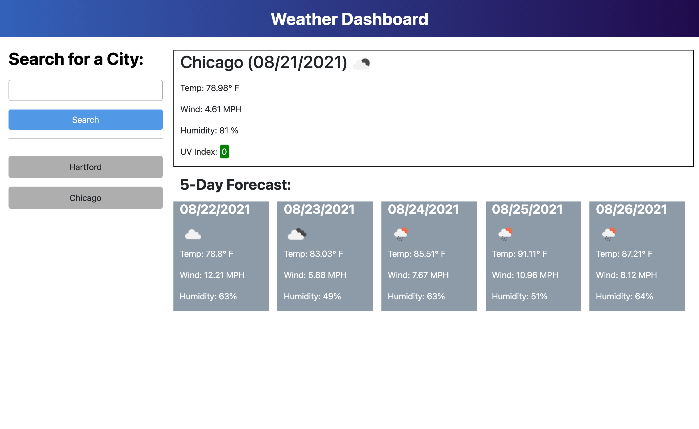

# Weather-App

## Description

This application is a weather application, built with the one call open weather API to show current weather for the searched city, including a general weather icon representing the current conditions, temperature, wind speed, humidity percentage, and UV index that is displayed with a background color to indicate if the UV index is a favorable, moderate, or severe condition. There is also a 5-day forecast shown for the searched city.

## Installation

Simply click the link to deploy the weather application.

## Usage

The purpose of this application is to allow users to view the current conditions along with a 5-day forecast for the city in which they searched. This application saves previously searched cities and displays them in a list below the search component of the application. The user can simply click any of the previously searched cities to view the weather conditions for that particular city. Within the current weather section of this applicaton, the city name and current date is shown, along with a weather icon representing the current conditions, temperature provided in degrees farenheit, wind speed displayed in miles per hour, humidity levels, and color-coded UV index values to indicate if conditions are favorable (green), moderate(yellow), or severe(red). The five-day forecast also provides the date, weather icon, temperature, wind speed and humidity in percentages for the next 5 days.

## Built with:

- HTML
- CSS
- JavaScript
- jQuery
- Bootstrap
- Moment.js
- One Call Open Weather API

## This application can be found:

https://michellewehr.github.io/weather-app/

## The github repository for this application can be found:

https://github.com/michellewehr/weather-app

## Contribution

Anyone is welcome to contribute to this project. To do so, clone the local repository to your local workspace.

## Sources

UCONN's School of Engineering Coding bootcamp provided the mock-up in which the author based the project off of. The One Call Open Weather API was used to make this application. The link to this API: https://openweathermap.org/api/one-call-api
Here is a picture of the mock-up design provided by UCONN's School of Engineering Coding Bootcamp:

(The background color was changed for the five day forecast to better see the weather icons)

## Author

Michelle Napolitano Wehr
